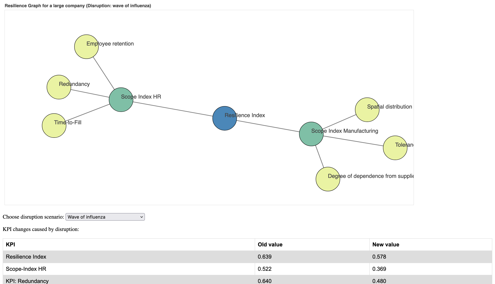

# GRACE

## 1. Description

Resilience has become crucial for manufacturing organizations in the face of various crises and uncertainties. However, current risk management practices often lack systematic resilience assessment due to the fuzzy nature of resilience. We introduce GRACE, a model for graph-based organizational resilience assessment in the manufacturing sector. GRACE utilizes centrality measures to model key performance indicators (KPIs) of business units for highlighting critical areas that significantly influence organizational functionality. By employing resilience metrics and a graph-based representation, simulated disruption scenarios can be induced for identifying vulnerabilities in business units that may lead to lower resilience. The effectiveness of GRACE was demonstrated within a simulation service for risk and crisis management in manufacturing and evaluated in a case study. Results showcased GRACE's performance in resilience assessment and its potential to enhance organizational preparedness with respect to response strategies.

## 2. Case Study

As a preliminary validation of the proposed model, we conducted a case study with the implemented service to evaluate its performance in assessing the resilience of a manufacturing company for two simulated disruption cases by using data from German manufacturing organizations. Here, we applied a data set on scopes and KPIs with initial values from manufacturing organizations in Germany obtained by a quantitative study with experts in a research project. Case 1 was characterized by a supply chain DisruptionScenario, e.g., as induced by the prolonged closing of important logistics hubs due to COVID-19 (cf. Table 1 below). Relevant KPIs affected by such a scenario were for instance the spatial distribution of the supplier network, the degree of dependence on suppliers, and the machines' fault tolerance; all linked within the business unit production. As a concrete DisruptionItem the complete shutdown of input material supply from China within a TimeDimension of one month was fired onto the graph. This induced a decrease of ScopeIndex in production based on the changes in relevant KPIs (cf. Table 1 below), e.g., dependence on suppliers increased due to the reduction of supply sources, resulting in the corresponding KPI value decreasing from 0.76 to 0.60. The organizations resilience index would decrease from 0.64 to 0.54. In this case, the service recommends ActionCategories like the preventive diversification of the supply by enlarging the supplier network and adding additional supply routes [1].

Case 2 was represented by an Influenza epidemic during Winter. Relevant KPIs influenced by such a scenario were for instance redundancy of skills and competences in all units, level of employee retention and time-to-fill of open positions; all assigned to the business unit human resources. As a concrete DisruptionItem an Influenza wave in all business units within a TimeDimension of three weeks was fired onto the graph. This induced a decrease of ScopeIndex in human resources based on the changes in relevant KPIs (cf. Table 1), e.g., the redundancy KPI dropped from 0.64 to 0.48. Thus, by propagating through the graph, the organizations resilience index would decrease from 0.64 to 0.58. In this case, the service recommends ActionCategories like hiring employees with temporary contracts to cushion shortcomings in staff numbers as well as the deployment of an internal knowledge transfer system to establish redundancy in key positions. 

Table 1. Results of preliminary case study with the prototypical service to evaluate the performance of the underlying model GRACE in assessing the organizational resilience of a manufacturing company for two simulated disruption cases (Case 1, Case 2). Initial values of KPIs and indices on business unit and organization level as well as their changes induced by disruption cases 1 and 2 are given. Higher values mean better resilience.

| Level (Extract)                 | KPIs & Indices (Extract) | Initial value | Case 1 | Case 2 |
|---------------------------------|--------------------------|---------------|--------|--------|
|                                 | Machines' tolerance      | 0.82          | 0.66   | 0.82   |
|                                 | Supplier dependency      | 0.76          | 0.60   | 0.76   |
|                                 | Supplier distribution    | 0.61          | 0.45   | 0.61   |
| Business unit 'Production'      | Scope Index              | 0.72          | 0.56   | 0.72   |
|                                 | Skill redundancy         | 0.64          | 0.64   | 0.48   |
|                                 | Time-to-fill             | 0.34          | 0.34   | 0.18   |
|                                 | Employee retention       | 0.53          | 0.53   | 0.41   |
| Business unit 'Human Resources' | Scope Index              | 0.52          | 0.52   | 0.37   |
| Organization                    | Resilience Index         | 0.64          | 0.54   | 0.58   |

## 3. Running the demonstrator

- There are no requirements besides having a recent browser installed (e.g., Chrome or Firefox).
- To run the demonstrator, simply open any of the HTML files included in this repository (e.g., KMUpre.html) in your browser.
To switch between disruption scenarios, select the desired item from the dropdown menu right under the graph visualization.
To switch been company sizes, select the corresponding item from the dropdown menu at the top of the page.

## 4. Experiment with own settings and disruptions

- To run the backend only, Java and Gradle are required to be installed on your system. Navigate to the "backend" folder and run the following command in your shell terminal:
    '''
    "./gradlew run" in your shell terminal.
    '''
- To experiment with the backend and implement your own company settings as well as disruption scenarios, go to the "backend" -> "app" -> "config" folder. Here, you'll find two subfolders:
    - The "system" folder contains system configurations. These are JSON files defining the possible disruptions as well as the relevant scopes, KPIs and their weights. You can take a look at any of the files and adapt them to your wishes or implement your own. The disruption scenario evaluation always uses the file called "system_config.json", so make sure to rename the current file with this name and rename the config file you want to be simulated accordingly.
    - The "user" folder contains the disruption configurations. All KPIs (that must always match the KPIs defined in the system configuration, see above) are assigned their current (pre-disruption) value, and a specific disruption is selected from the list of possible disruptions defined in the system configuration. Here as well, the disruption scenario evaluation uses only the "user_config.json" file. Thus, make sure to rename your file(s) accordingly.
 
## References

[1] Lopes, J. M., Gomes, S., & Mané, L. (2022). Developing knowledge of supply chain resilience in less-developed countries in the pandemic age. Logistics, 6(1), 3.
