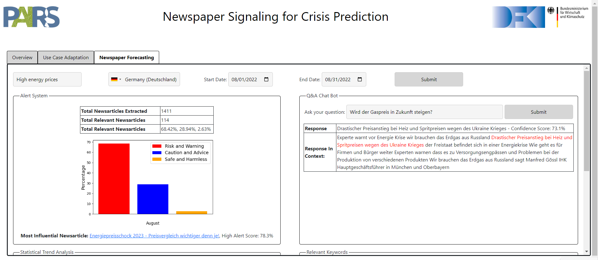

# Newspaper Signaling

## 1. Description


<p> 

To establish sophisticated monitoring of newspaper articles for detecting crisis-related signals, natural language processing has to cope with unstructured data, media, and cultural bias as well as multiple languages. So far, research on detecting signals in newspaper articles is focusing on structured data, restricted language settings, and isolated application domains. When considering complex crisis-related signals, a high number of diverse newspaper articles in terms of language and culture reduces potential biases. We demonstrate MENDEL – a model for multi-lingual and open-domain newspaper signaling for detecting crisis-related indicators in newspaper articles. The model works with unstructured news data and combines multiple transformer-based models for pre-processing (STANZA) and content filtering (Roberta, GPT-3.5). Embedded in a Question-Answering (QA) setting, MENDEL supports multiple languages (>66) and can detect early newspaper signals for open domains in real-time.
    
</p>


## 2. Approach

<p> 

We present MENDEL, a model for multi-lingual and open-domain newspaper signaling for crisis prediction powered with a real-time alert system, a QA chatbot, and data visualization aids. Our framework consists of four main modules: Data acquisitions, Pre-processing pipeline, Two-stage data filtration, Context-based reasoning & forecasting. MENDEL operates on keywords given by a user with additional parameters. This serves as input to the data acquisition layer. Outputs of these modules are fed to the pre-processing pipeline and process the data that can be directly fed to our two-stage data filtration stage. It mainly performs extensive filtering of the articles and capable of finding early signals. Outputs are finally passed to Context-based Reasoning & Forecasting. This component find high alerts and generates context which is passed to a QA chatbot. This pipeline completely uses unstructured data and is an open domain for signaling a crisis.

<p> 

## 3. Domain-Adaptation

<p> 

For real-time analysis of the newspaper articles for any use-case related to crisis, the MENDEL can be adapted. It operates on keyword (Domain Specific) given by a user with additional parameters, i.e. Language, Country, and Timeframe. This serves as input to the data acquisition layer. It consists of several modules charged with generating domain-specific keywords i.e. Keyword expansion, extracting newspaper articles, and a data parser. With our additional subdoamin specific keyword, model further adapt the pipeline to focus on the subdomain. Therefore, with this domain Specific crisis relevant keywords our framework can adapt and establish sophisticated monitoring of newspaper articles for detecting crisis-related signals.

<p> 



## 4. Installation 


1. Create env in THW folder
```bash
    cd .\POC\Newspaper_Signalling\application\newspaperSignaling\
    virtualenv newspaperSignal
```

2. Activate env
```bash
   newspaperSignal\Scripts\activate
```

3. Requirements.txt file with all dependencies

4. Install dependencies
```bash
    pip install -r requirements.txt
```

5. Run application
```bash
    cd .\backend\
	python manage.py runserver  

- Finally, go the internet browser (e.g. Chrome) and type in the url <http://127.0.0.1:5000>


