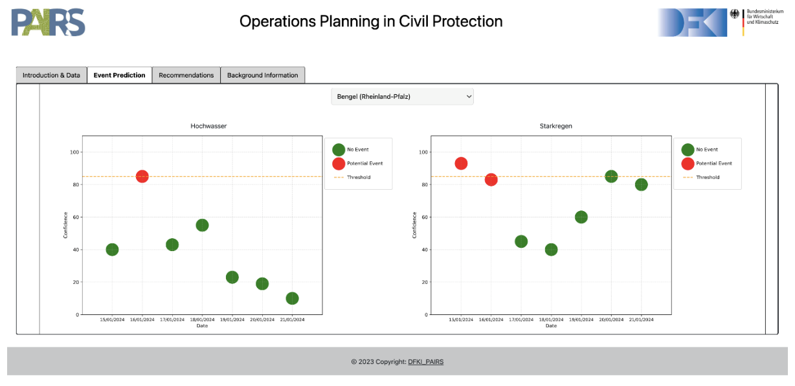
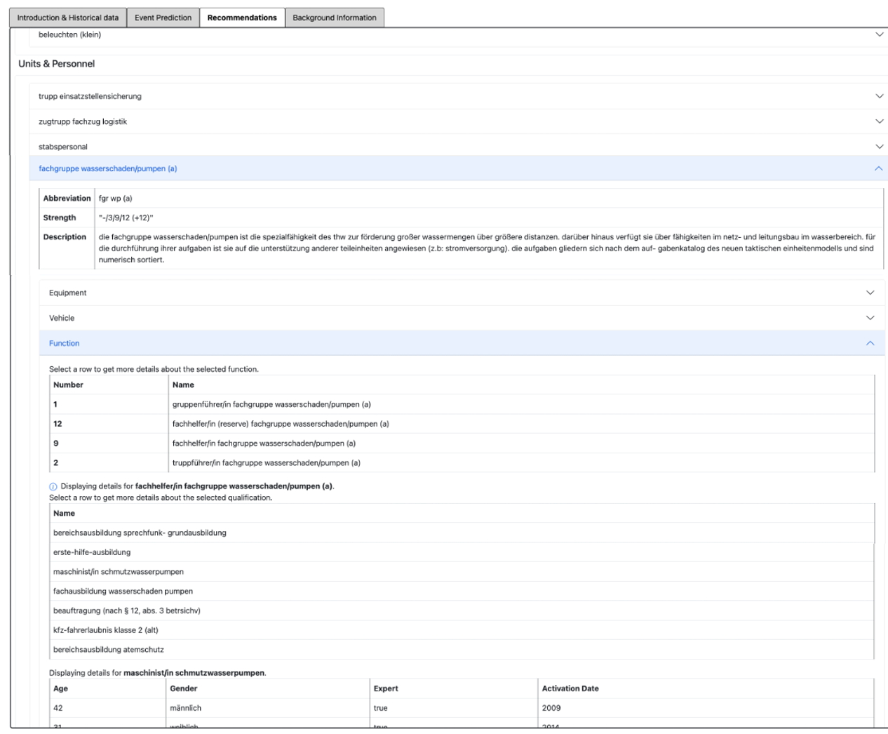

# Operations Planning in Civil Protection

During occurring crisis events, time of response, allocation of equipment, tasks and personnel pose critical success factors to crisis operations conducted by responders (e.g., professional units and volunteers within civil protection and related domains). Respective operation plans are currently compiled manually by experienced planning officers or in combination with supporting systems, that either lack concrete planning recommendations, or focus on post-disaster recommendations for operation plans on-site of a crisis event. We present a service to support proactive operation planning by means of an early event prediction and semantically enhanced historical knowledge using operational scenario patterns. The model was applied on data of a German organization within civil protection and predicts weather-based crisis events for the next 7 days in combination with automated planning recommendations. We plan to evaluate the effectiveness of the instantiated service within am empirical user study.


## Operational Scenario Patterns

Operational Scenario Patterns(OPS) semantically enhance historical knowledge on crisis operations. OPS build up on the works of [1,2}, describing scenario patterns as representation of crisis events [3,4,5,6,7,8,9,10,11]. We adjusted naming conventions and entities based on existing ontologies and requirements of operations within civil protection and related domains [12,13,14]. OPS contain the following entities and use existing semantic vocabularies and ontologies, such as [foaf](http://xmlns.com/foaf/0.1/), [beAware](https://github.com/beAWARE-project/ontology), [LODE](https://linkedevents.org/ontology), [Empathi](https://w3id.org/empathi/1.0), [schema.org](http://schema.org), to transfer historical data into a knowledge graph operationalized in JSON-LD.
The resulting knowledge graph is used as foundation in order to generate planning recommendations for predicted crisis events.


## German Federal Agency for Technical Relief
Our model was instantiated as a service in cooperation with the German Federal Agency for Technical Relief (German abbreviation 'THW'), an agency of the German Federal Ministry of the Interior and Community. Operation options include e.g. debris clearance, electricity supply, bridge building, refugee aid or logistics, which serve the general purpose of maintaining public structures and critical infrastructure. Furthermore, THW units can be requested to aid operations of external organizations (e.g., fire departments). Presently, operation plans at THW are compiled manually by planning officers in combination with weather forecasts (i.e., a [German weather service](https://www.dwd.de/DE/Home/home_node.html) )to have a rough estimate of incoming crisis events. Although THW collects historical information on conducted operations, reports can differ (i.e., regarding format, details on conducted tasks) and are stored within large data bases. Furthermore, general information on operation options and actions, units and resources are only available within unstructured textual documentations (PDF files). Historical data are therefore only of limited use to planning experts for allocating tasks and human resources to crisis operations and they currently depend on acquired knowledge to make planning decisions.

## Service Features
- Explorable knowledge graph representation of historical datasets in the form of OSP
- Crisis operation prediction for the next 7 days
- Territorial map overview
- Recommendations for Operations Planning to handle crises events

## Interface
First introductory information and statistics on the utilized database further background information on the knowledge graph are presented in the user interface. Additionally the UI consists of two main components: 


In the Event Prediction tab events like floods, heavy rain and snow are displayed in a forecasting graph after selecting the location of interest in Germany. Red dots indicate the respective prediction of the event. For predicted events, recommendations for action are generated in the Recommendations tab


A short demo of the service can be viewed [here](https://www.youtube.com/watch?v=ohWVGATnjZM&t=1s) .<br>
A one pager with all important key information can be found [here](https://www.dfki.de/fileadmin/dfkimanager/projects/Project_1440/One_Pager_Operations_Planning.pdf) .<br>
Please note: Since we are dealing with a German data set, generated recommendations (e.g. unit names, unit descriptions etc.) are also presented in German, respectively to the German knowledge base.

## Data
Our service accepts CSV files as initial data input and is currently designed based on the structure given by the historical data provided by THW. The data contain the following features: 

Operation data:  Location, type and date of the crisis event; operation Id; internally assigned service project (precondition in OSP); requesting party; planner; operation duration; a short report (postcondictions in OSP); number of deployed helpers and conducted duty hours; conducted tasks

Data on personnel: Id; age; gender; residence; skills

Data on units: Unit name and abbreviation; unit descriptions; potential tasks; needed qualifications to be assigned to the unit; roles and required personnel per role; unit strength; required equipment and vehicles for potential tasks

## Prediction of Crisis Operations

To enable early planning of operations, we included a prediction of crisis operations focusing on weather-dependent events (e.g., rain, snow, flood events), as these almost cover 24\% of the overall historical data set on THW operations. We adapted the approach used in [1,15] for our prediction, using [historical weather data](https://www.kaggle.com/datasets/noaa/gsod?select=gsod2019) and [current weather data](https://openweathermap.org/)(e.g., coordinates of weather station, temperature, wind speed, gust, precipitation). We calculated the coordinates of each historical operation location using the Geopy library, in order to map operations to the closest weather station using Euclidean distance. The event prediction was treated as a multi-class classification problem. The data set was divided into training, validation and test set with a ratio of 70:10:20. We experimented with different forecasting models, while XGBoost outperformed all other models in terms of overall accuracy (0.92) (see Table 1). 

Table1: Comparison of achieved accuracy by diverse forecasting models


XGBoost also outperformed other models based on F1 score (see Table 2), which is an essential metric that combines precision (correct predictions per class) and recall (completeness of correct predictions per class) into a single value, providing a comprehensive evaluation of a model's performance. Based on the amount of available data per weather-dependent crisis event, we needed to cluster similar events in order to increase data quality for the prediction model. We were able to receive best F1-scores for rain based event types (0.9) (i.e., heavy rain and flood events) and snow event types (0.94) (i.e., snowfall, avalanches, frost). We were not able to split the remaining events any further (e.g., wildfires, landslides, blackouts) without loosing accuracy for
the prediction, which is why we further clustered them as 'other events'.

Table 2: Classification results of different models on predicting crisis events in Germany (P = precision, R = recall, F1 = f1 score)


Based on selected location of the user, events are predicted for the next 7 days.  The event prediction was evaluated for 10 THW locations across Germany (i.e., Göttingen, Aachen, Trier, Augsburg, Biberach, Chemnitz, Regensburg, Neubrandenburg, Schwerin, Kiel) within our service.


## References
[1] S. Janzen, N. Gdanitz, L. Abdel Khaliq, T. Munir, C. Franzius, W. Maass. (2023). Anticipating Energy-driven Crises in Process Industry by AI-based Scenario Planning, HICSS (2023). <br>
[2] S. Leachu, J. Janßen, N. Gdanitz, M. Kirchhöfer, S. Janzen. (2023). Cascading Scenario Technique enabling Automated and Situation-based Crisis Management, CPSL (2023). <br>
[3] Watahiki, K., & Saeki, M. (2001). Scenario evolution in requirements elicitation processes: scenario pattern and framework approach. In Proceedings of the 4th International Workshop on Principles of Software Evolution (pp. 166-169). <br>
[4] Watahiki, K., & Saeki, M. (2001). Scenario patterns based on case grammar approach. Proc. of Fifth IEEE Int. Symposium on Requirements Engineering, 300–301. <br>
[5] Alspaugh, T. A., Anto ́n, A. I., Barnes, T., & Mott, B. W. (1999). An integrated scenario management strategy. Proc. of IEEE Int. Symposium on Requirements Engineering (Cat. No. PR00188), 142–149. <br>
[6] Do Prado Leite, J. C. S., Hadad, G. D., Doorn, J. H., & Kaplan, G. N. (2000). A scenario construction process. Requirements Engineering, 5(1), 38–61. <br>
[7] Hoekstra, R. (2009). Ontology representation: Design patterns and ontologies that make sense. University of Amsterdam. <br>
[́8] Smiałek,M. (2007). Software development with reusable requirements-based cases. Oficyna Wydawnicza Politechniki Warszawskiej. <br>
[9] Tsai, W.-T., Yu, L., Zhu, F., & Paul, R. (2005). Rapid embedded system testing using verification patterns. IEEE software, 22(4), 68–75. <br>
[10] Rolland, C., Ben Achour, C., Cauvet, C., Ralyte ́, J., Sutcliffe, A., Maiden, N., Jarke, M., Haumer, P., Pohl, K., Dubois, E., et al. (1998). A proposal for a scenario classification framework. Requirements Engineering, 3(1), 23–47. <br>
[11] Xie, Z., Jayanth, A., Yadav, K., Ye, G., & Hong, L. (2021). Multi-faceted classification for the identification of informative communications during crises: Case of covid-19. 2021 IEEE 45th Annual Computers, Software, and Applications Conference (COMPSAC), 924–933. <br>
[12] E. Kontopoulos, P. Mitzias, J. Moßgraber, P. Hertweck, et al., Ontology-based representation of crisis management procedures for climate events., in: ISCRAM, 2018. <br>
[13] M. Gaur, S. Shekarpour, A. Gyrard, A. Sheth, Empathi: An ontology for emergency managing and planning about hazard crisis, in: ICSC, IEEE, 2019, pp. 396–403. <br>
[14] S. Chehade, N. Matta, J.-B. Pothin, R. Cogranne, Data interpretation support in rescue operations: Application for french firefighters, in: AICCSA, IEEE, 2018, pp. 1–6 <br>
[15] N. Gdanitz, L. Abdel Khaliq, A. Ahiagble, S. Janzen, W. Maass, Powop: Weather-based power outage prediction, IntelliSys (2023).

## Installation

1. [Create and run the local Neo4J graph database](https://neo4j.com/docs/operations-manual/current/installation/)
<br> Password currently set to 'password' but can be changed in
```sh
Modules/THW/backend/prediction/view.py
driver = GraphDatabase.driver("bolt://localhost:7687/neo4j", auth=("neo4j", "password"))
```

2. Create and activate the Python environment

```sh
cd .\Modules\THW\
virtualenv thw_test
thw_test\Scripts\activate
```

3. Install all dependencies

```sh
pip install -r requirements.txt
```

4. Migrations

```sh
python manage.py makemigrations
```
```sh
python manage.py migrate
```

5. Run the application 

```sh
cd ./backend/
python manage.py runserver
```
